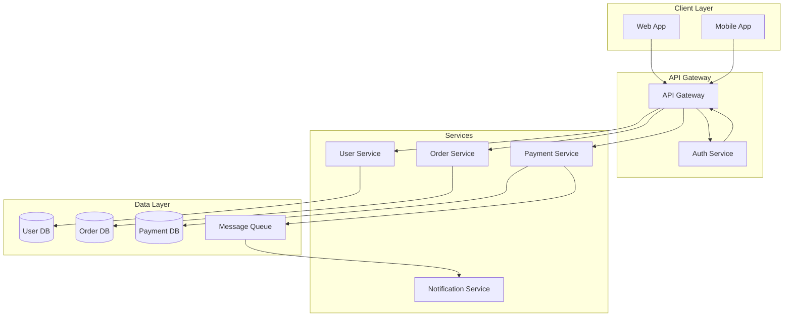
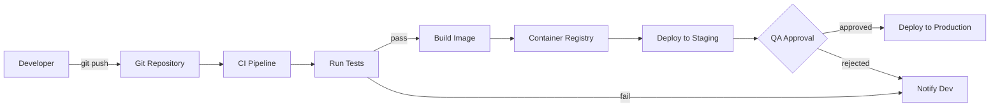

# System Architecture

## Microservices Architecture

```mermaid
graph TB
    subgraph Client Layer
        Web[Web App]
        Mobile[Mobile App]
    end

    subgraph API Gateway
        GW[API Gateway]
        Auth[Auth Service]
    end

    subgraph Services
        US[User Service]
        OS[Order Service]
        PS[Payment Service]
        NS[Notification Service]
    end

    subgraph Data Layer
        DB1[(User DB)]
        DB2[(Order DB)]
        DB3[(Payment DB)]
        MQ[Message Queue]
    end

    Web --> GW
    Mobile --> GW
    GW --> Auth
    Auth --> GW
    GW --> US
    GW --> OS
    GW --> PS
    US --> DB1
    OS --> DB2
    PS --> DB3
    PS --> MQ
    MQ --> NS
```

## CI/CD Pipeline

```mermaid
flowchart LR
    Dev[Developer] -->|git push| Repo[Git Repository]
    Repo --> CI[CI Pipeline]
    CI --> Test[Run Tests]
    Test -->|pass| Build[Build Image]
    Test -->|fail| Notify[Notify Dev]
    Build --> Registry[Container Registry]
    Registry --> Staging[Deploy to Staging]
    Staging --> QA{QA Approval}
    QA -->|approved| Prod[Deploy to Production]
    QA -->|rejected| Notify
```
