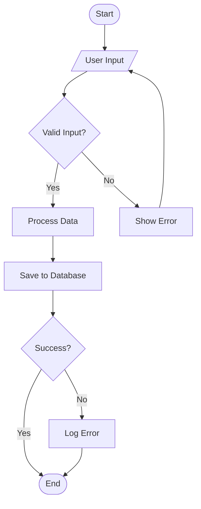
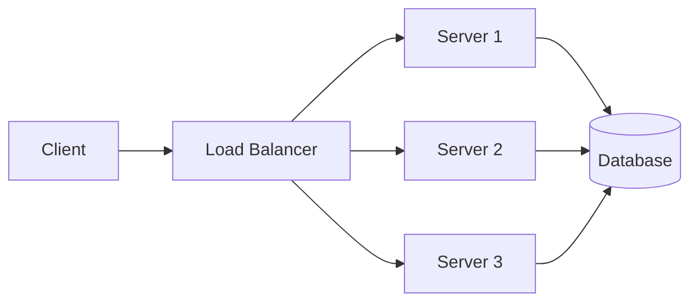

# Flowchart Example

This document contains a sample flowchart.

```mermaid
flowchart TD
    A([Start]) --> B[/User Input/]
    B --> C{Valid Input?}
    C -- Yes --> D[Process Data]
    C -- No --> E[Show Error]
    E --> B
    D --> F[Save to Database]
    F --> G{Success?}
    G -- Yes --> H([End])
    G -- No --> I[Log Error]
    I --> H
```

Another simpler flowchart:

```mermaid
flowchart LR
    A[Client] --> B[Load Balancer]
    B --> C[Server 1]
    B --> D[Server 2]
    B --> E[Server 3]
    C --> F[(Database)]
    D --> F
    E --> F
```
