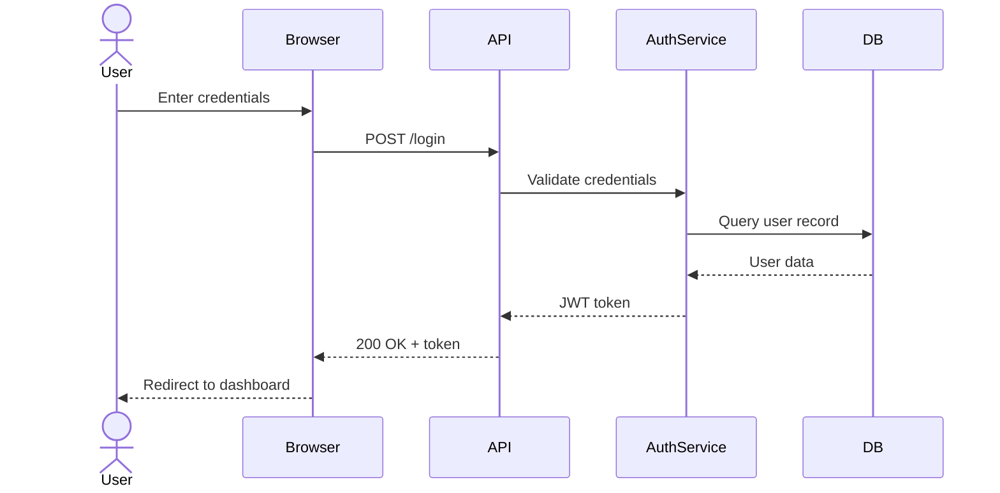
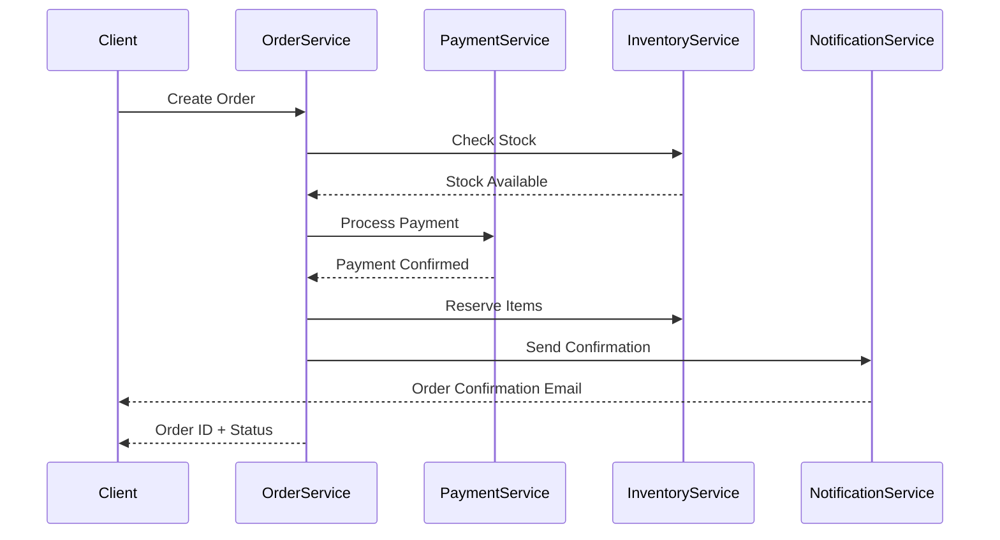

# Sequence Diagrams

## Login Flow

```mermaid
sequenceDiagram
    actor User
    participant Browser
    participant API
    participant AuthService
    participant DB

    User->>Browser: Enter credentials
    Browser->>API: POST /login
    API->>AuthService: Validate credentials
    AuthService->>DB: Query user record
    DB-->>AuthService: User data
    AuthService-->>API: JWT token
    API-->>Browser: 200 OK + token
    Browser-->>User: Redirect to dashboard
```

## Order Processing

```mermaid
sequenceDiagram
    participant Client
    participant OrderService
    participant PaymentService
    participant InventoryService
    participant NotificationService

    Client->>OrderService: Create Order
    OrderService->>InventoryService: Check Stock
    InventoryService-->>OrderService: Stock Available
    OrderService->>PaymentService: Process Payment
    PaymentService-->>OrderService: Payment Confirmed
    OrderService->>InventoryService: Reserve Items
    OrderService->>NotificationService: Send Confirmation
    NotificationService-->>Client: Order Confirmation Email
    OrderService-->>Client: Order ID + Status
```
